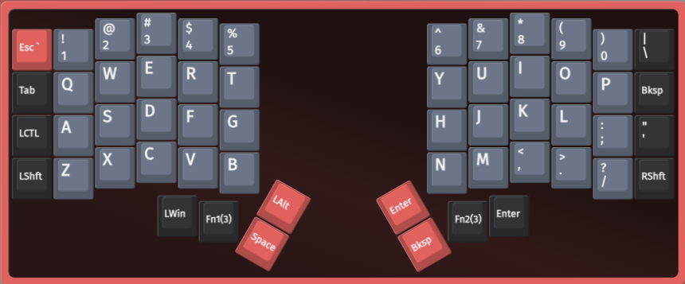
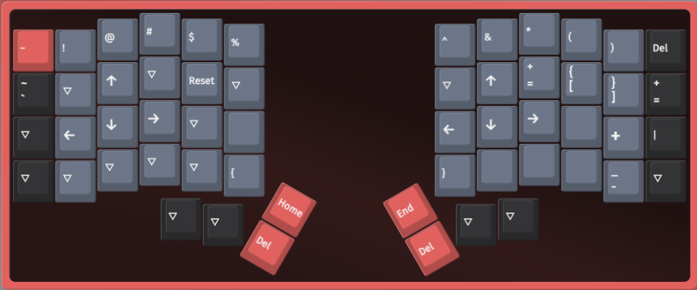
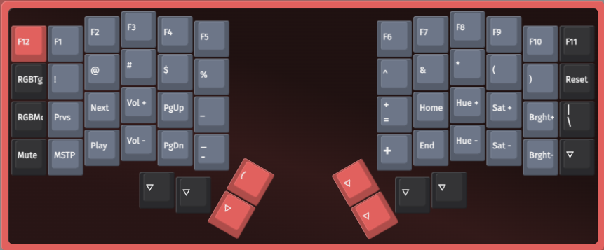

# Iris-lm

56 key low-profile split keyboard from [keebio](https://keeb.io). Configurable on the web via [usevia](https://usevia.app/). For MX version you can find blank keycaps from [tai-hao](https://shop.tai-hao.com/products)

## Layers

As of 25/3/2025

### Base

### Layer 1

### Layer 2

